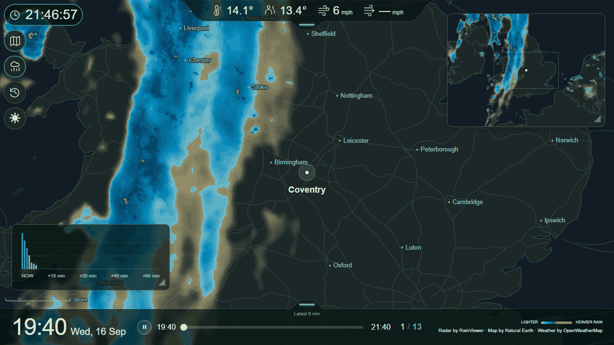
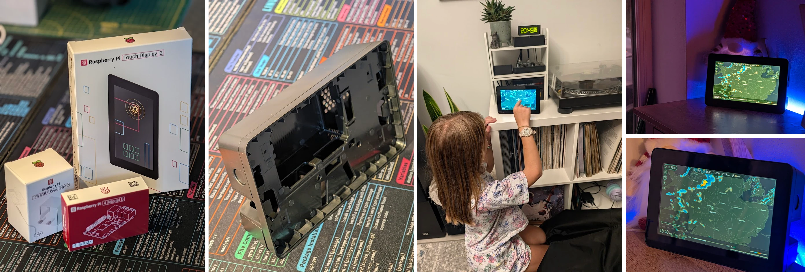

# Pi Rain Radar

A dedicated rain-radar screen for your home. Animate recent rain, see where it has been moving, and glance at optional current temperature and wind readings.



*Recorded on 16 September 2026 in v0.3.0: 13 radar frames over Coventry, spanning 19:40–21:40 BST, with Overview and Rain forecast open. Historical demonstration, not live conditions; weather readings and Rain forecast reflect capture time. Radar by [RainViewer](https://www.rainviewer.com/), basemap by [Natural Earth](https://www.naturalearthdata.com/), weather by [OpenWeather](https://openweathermap.org/). [Static preview](docs/images/radar-preview-20260916-2147.png).*

## Status

**[v0.8.0](https://github.com/alex-soul/pi-rain-radar/releases/tag/v0.8.0) is the current pre-release.** It adds cloud layers, configurable weather trend charts, local Sun/Moon information, expanded HA readings and clearer camera/Archive playback. I tested RC3 on my Pi 4 / 2 GB and confirmed smooth operation again after installing the published 0.8.0 image. Longer soak and cloud publication-delay observations continue; see [release notes](docs/release-0.8.0.md) and [follow-ups](docs/follow-ups.md).

**Upgrading from 0.6.0 or earlier starts a fresh archive and removes the old rolling history (up to seven days).** [Back up first](docs/archive-backup.md) if you want to preserve it. Keys, PIN, map and browser preferences remain; Live rebuilds from available radar. Existing 0.7.0 candidate archives are preserved. See [upgrade details](docs/upgrading.md#070-new-archive-and-shared-integrations).

Pi Rain Radar focuses on rain: recent radar playback, a small overview map, optional next-hour precipitation forecasts and a few current readings. It is not a general-purpose weather dashboard.

See [what’s next](docs/follow-ups.md) for planned improvements and ideas for future releases.

## Run with Docker

Install Docker with the Compose plugin. For a new installation on Linux or a Pi (existing installations should use [Upgrade](#upgrade)):

```sh
mkdir -p ~/apps/pi-rain-radar
cd ~/apps/pi-rain-radar
curl -fL https://raw.githubusercontent.com/alex-soul/pi-rain-radar/main/compose.yaml -o compose.yaml
docker compose pull
docker compose up -d
```

Use `sudo docker` if your Linux user needs it. Open [localhost:3080](http://localhost:3080) on the host, or `http://<host-name>.local:3080` from another device on your home network. Allow roughly 2–3 minutes for initial radar acquisition.

The configuration download follows `main`; Docker runs the latest published image, including pre-releases. It does not build unreleased application source. For a fixed release and matching configuration, see [version pinning](docs/upgrading.md#pinning-a-version-and-rollback).

Ready-built images support Linux ARM64 (64-bit Raspberry Pi OS) and AMD64. No Git, Node installation or local build is needed. For Windows/macOS and remote setup of Map, OpenWeather and optional PIN, see [Quick Start](docs/quick-start.md).

### Upgrade

Device Power enabled? Follow the [power upgrade instructions](docs/device-power.md#upgrade) first.

```sh
cd ~/apps/pi-rain-radar
docker compose pull
docker compose up -d
```

Settings stay in the existing data volume. The first upgrade to 0.7.0 resets older-format history; later compatible upgrades preserve the new archive. Browsers running v0.1.2 or later reload automatically when the app version changes, after Settings is closed. See [upgrades and migration](docs/upgrading.md) for older source installs and version pinning. The `latest` channel currently includes pre-releases; upgrades happen only when you run these commands.

## What you get

- **See what is there—and what is missing.** Two, four or six hours of Live radar with adjustable playback speed and per-map detail in the [availability popup](docs/indicators.md#5-frame-gaps). Provider gaps stay visible, and late observations fill their original positions.
- **RainViewer or Rainbow Weather — or both.** Choose either provider for Main and Overview independently, so you can compare them or manually switch when one has problems.
- **Optional Rainbow rain and cloud layers.** Usage depends on map geometry and enabled layers. Actual local counters and an optional request cap help track it; see [setup, costs and limits](docs/radar-providers.md).
- **Explore up to 24 hours of radar history.** Scrub or replay a selected window from the local rolling archive (seven days by default, configurable), with optional provider labels. [Archive playback](docs/manual.md#look-back-with-archive) shows the observations actually available and builds as the app runs.
- **Camera and historical weather.** Collect one direct or Home Assistant camera snapshots at a configurable one-to-ten-minute interval. Replay it alongside saved readings and Rain forecast. Generic HA sensors can supply all ten source readings, with optional OpenWeather fallback. See [setup](docs/manual.md#camera-setup).
- **One radar server, multiple displays.** Each browser remembers its own buttons, layout and theme while sharing the same configured location and acquisition. Use it on your [home network](docs/quick-start.md#3-open-it-from-your-laptop), optionally [install it on phones and laptops or connect privately through Tailscale](docs/pwa.md), and see the [Android and Windows examples](docs/pwa-gallery.md).
- **Playback that handles delays.** Live can reuse earlier radar for less than 30 minutes and automatically pause while waiting for enough data to resume. Missing observations remain visible; [Live and Archive rules](docs/playback-conventions.md) explain the difference.
- Coventry defaults, with location, map zoom and time zone configurable in Settings.
- Optional six-digit settings PIN, managed in the UI, with [host recovery](docs/troubleshooting.md#pin-recovery).
- Optional OpenWeather current temperature, feels-like, wind/gusts and minute precipitation forecast, using your own One Call 4.0 key.
- Ten optional source readings plus derived T−Td (dew point depression): temperature, feels-like temperature, wind speed, wind gusts, wind direction, humidity, dew point, visibility, pressure and UV index—with [configurable units and wind-arrow convention](docs/manual.md).
- **[Stats for nerds](docs/stats-for-nerds.md).** An optional widget shows provider freshness, acquisition timing, missing frames, weather updates and local Rainbow API counters.
- Subtle colour indicators show API health and data gaps without cluttering the screen; details are available in Settings and the log. See the [illustrated indicator guide](docs/indicators.md).
- Optional host restart/shutdown from Settings, per-display UI lock and a small diagnostic log.
- **Light/dark themes and touch controls.** Designed for 16:9 landscape displays and tested at 1280 × 720. Other screen shapes receive best-effort layout support.

Radar works out of the box without an API key. Overview and Rain forecast start closed.

## Running costs

Start with RainViewer for radar and add the optional sources you need. OpenWeather offers 1,000 One Call 4.0 calls/day free, but its default 2,000-call limit permits charges; set your account limit deliberately. Rainbow advertises 30,000 Tiles API tiles/month free, then $0.20 per 1,000 tiles. These are separate account allowances, shared with any other apps using them. Checked 24 September 2026: [OpenWeather](https://openweathermap.org/api/one-call-4), [Rainbow](https://developer.rainbow.ai/).

My current setup uses RainViewer on the main map and three Rainbow layers: Overview rain and clouds on both maps. Rain and clouds on both maps would be four Rainbow layers. I still need to run through a full month before I know the actual cost; neither setup has a guaranteed monthly bill. See [usage and limits](docs/radar-providers.md). Storage duration likewise depends on retention, enabled layers and available space.

## Hardware recommendations

- **[Raspberry Pi 4 Model B](https://thepihut.com/products/raspberry-pi-4-model-b)** — tested with 2 GB RAM.
- **[7-inch Raspberry Pi Touch Display 2](https://thepihut.com/products/raspberry-pi-touch-display-2)** — 1280 × 720 in landscape.
- **[15 W USB-C power supply](https://www.raspberrypi.com/products/type-c-power-supply/)** for the Pi 4.
- [SanDisk MicroSD Card (Class 10 A1)](https://thepihut.com/products/sandisk-microsd-card-class-10-a1) by SanDisk — 32 GB should be plenty based on current storage usage. I use a 64 GB A2-rated card simply because I already had one lying around.
- **Stand or enclosure of your choice** — I use the [Enclosure for Raspberry Pi Touch Display 2 (7")](https://thepihut.com/products/enclosure-for-raspberry-pi-touch-display-2-7) by OneNineDesign (SKU: ASM-1900192-21). The [Pibow Frame for Raspberry Pi Touch Display 2](https://thepihut.com/products/pibow-frame-for-raspberry-pi-touch-display-2) by Pimoroni (SKU: PIM757) is an alternative that keeps the Pi visible.

See the [Raspberry Pi setup guide](docs/raspberry-pi.md) for assembly and installation.

[](docs/images/hardware/gallery.webp)

## Documentation

- [Quick Start — install and configure from another computer](docs/quick-start.md)
- [Raspberry Pi build — unpacking to automatic kiosk, without an attached keyboard](docs/raspberry-pi.md)
- [User manual — settings and controls](docs/manual.md)
- [Screen indicators — numbered guide to colours and status](docs/indicators.md)
- [Radar providers — Rainbow setup, usage and limits](docs/radar-providers.md)
- [Device Power — optional restart/shutdown setup](docs/device-power.md)
- [Release follow-ups](docs/follow-ups.md)
- [Upgrades — routine updates, migration and rollback](docs/upgrading.md)
- [Troubleshooting and PIN recovery](docs/troubleshooting.md)
- [Development — local workflow and tests](docs/development.md)
- [Design — architecture, behaviour and known limitations](docs/design.md)
- [Validation — tested baseline and next checks](docs/validation.md)
- [Contributing](CONTRIBUTING.md)
- [Third-party data and licences](THIRD_PARTY_NOTICES.md)

Node.js 24, Sharp and plain browser JavaScript. The backend prepares map frames; the browser plays them over locally bundled maps. Settings and acquired data persist in a Docker volume. The supplied configuration serves port 3080 on the home LAN; an optional bind-address setting restricts it to loopback.

## Licence and data

Pi Rain Radar is [MIT-licensed](LICENSE). You may use, modify and redistribute the software, including commercially, while retaining the copyright and licence notice.

**Weather data is subject to separate provider terms.** RainViewer's public API is intended for personal, educational and small community use; commercial integrations must check terms with the provider. OpenWeather requires your own eligible subscription/key. See [third-party notices](THIRD_PARTY_NOTICES.md).

Radar data may be delayed or incomplete. Areas without rain colouring may have no detected rain—or no available data.

## Support

> [!TIP]
> Questions about installation, the interface, troubleshooting or development? Give your AI this repository link and ask. The documentation covers beginners and developers; [screen indicators](docs/indicators.md) explains the colours.

## Inspiration

Inspired by [Eric Lewin's Pi Weather Station](https://github.com/elewin/pi-weather-station). Pi Rain Radar is a new application, not a fork.
