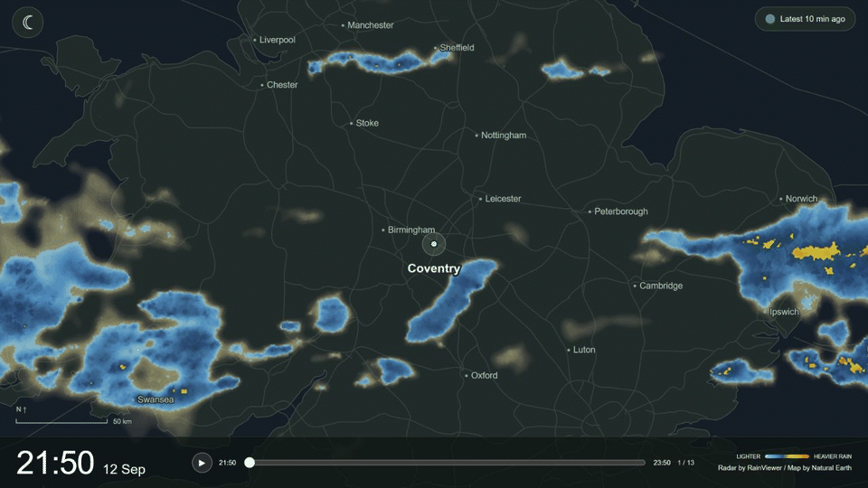

# Pi Rain Radar

A dedicated rain-radar screen for your home. Animate recent rain, see where it has been moving, and glance at optional current temperature and wind readings.



*Preview from an earlier build; historical imagery, not live conditions. Radar by [RainViewer](https://www.rainviewer.com/), basemap by [Natural Earth](https://www.naturalearthdata.com/). [Static preview](docs/images/radar-preview.png).*

## Status

**v0.1.1 is a pre-release.** A manual Raspberry Pi walkthrough has confirmed Docker deployment, landscape touch controls, automatic kiosk startup after reboot and access from another computer on the home network. Sustained performance and recovery testing remain in progress. A complete beginner hardware guide is being prepared from that walkthrough.

Pi Rain Radar focuses on rain: recent radar playback, a small overview map, optional next-hour precipitation forecasts and a few current readings. It is not a general-purpose weather dashboard.

## Run with Docker

Install Docker with the Compose plugin, then:

```sh
git clone --branch v0.1.1 --depth 1 https://github.com/alex-soul/pi-rain-radar.git
cd pi-rain-radar
docker compose up -d --build
```

Open **[localhost:3080](http://localhost:3080)** on the same machine. Allow roughly 2–3 minutes for the first radar history to download, longer if the provider or connection is slow. Docker builds the app locally; no registry image is published.

For installation without Git, use the [Quick Start guide](docs/quick-start.md). To open the app and configure API keys from another device on your home network, follow [LAN access](docs/quick-start.md#enable-lan-access-on-v010).

## What you get

- Up to two hours of animated radar, refreshed automatically, with pause and a timeline.
- A seven-day local archive that builds while the app runs.
- One Pi, multiple screens: each browser remembers its own buttons, widget layout and theme while sharing the same location and data. Radar and weather acquisition are shared between screens. See [LAN setup](docs/quick-start.md#enable-lan-access-on-v010).
- Last-good cached playback through outages; incomplete timestamps do not block newer complete frames.
- Coventry defaults, with location, map zoom and time zone configurable in Settings.
- Optional six-digit settings PIN, managed in the UI, with [host recovery](docs/quick-start.md#pin-recovery).
- Optional OpenWeather current temperature, feels-like, wind/gusts and minute precipitation forecast, using your own One Call 3.0 key.
- Light/dark themes and touch controls. Target display: 1280 × 720 landscape; other shapes crop the map.

No PIN or API key is needed to start viewing radar. Overview and MinuteCast start closed. The app runs independently of Home Assistant.

## Documentation

- [Quick Start — installation, settings, controls and troubleshooting](docs/quick-start.md)
- [Development — local workflow and tests](docs/development.md)
- [Design — architecture, behaviour and known limitations](docs/design.md)
- [Contributing](CONTRIBUTING.md)
- [Third-party data and licences](THIRD_PARTY_NOTICES.md)

Node.js 24, Sharp and plain browser JavaScript. The backend prepares image pairs; the browser plays them over locally bundled maps. Settings and acquired data persist in a Docker volume. The supplied configuration binds to this machine's loopback address only.

## Licence and data

Pi Rain Radar is [MIT-licensed](LICENSE). You may use, modify and redistribute the software, including commercially, while retaining the copyright and licence notice.

**Weather data is subject to separate provider terms.** RainViewer's public API is intended for personal, educational and small community use; commercial integrations must check terms with the provider. OpenWeather requires your own eligible subscription/key. See [third-party notices](THIRD_PARTY_NOTICES.md).

Radar is delayed and coverage is best effort. An uncoloured area is not proof that it is dry.

## Inspiration

Inspired by [Eric Lewin's Pi Weather Station](https://github.com/elewin/pi-weather-station). Pi Rain Radar is a new application, not a fork.
