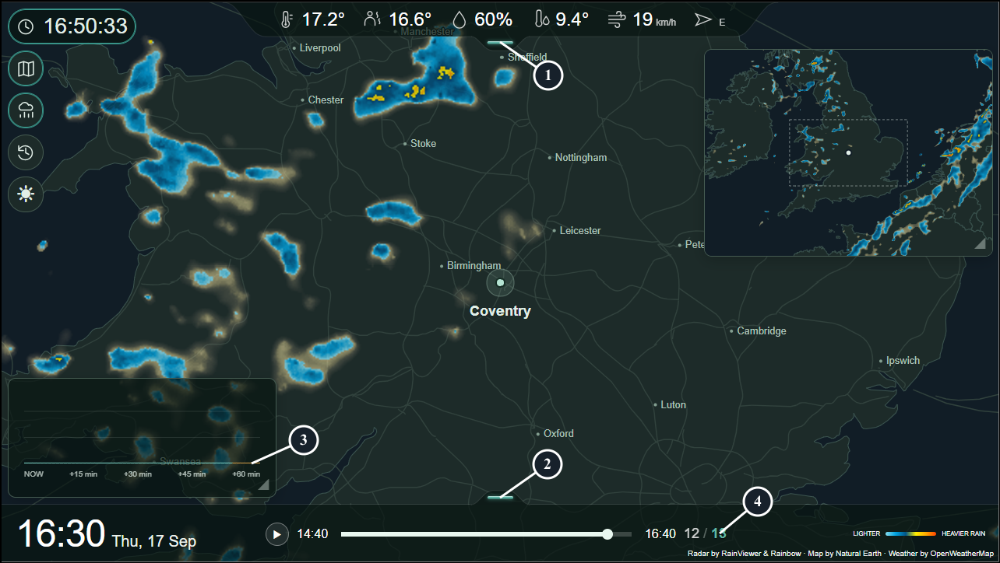
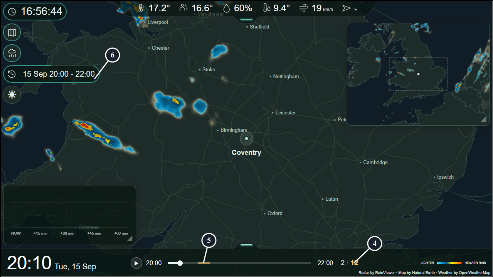

# Screen indicators

This page is the single reference for status colours and symbols. For setup and controls, see the [manual](manual.md).

*My Pi running the 0.4.0 release candidate on 17 September 2026. The amber tail in Rain forecast shows minutes beyond the last acquired forecast. Numbers 1-4 mark the indicators in this live view. Radar by [RainViewer](https://www.rainviewer.com/) and [Rainbow](https://rainbow.ai/), map by [Natural Earth](https://www.naturalearthdata.com/), weather by [OpenWeatherMap](https://openweathermap.org/).*

*The same Pi in History: **4** marks the amber total of 12 available frames, **5** the missing timeline position, and **6** the countdown around the History control. This two-hour window is incomplete: a full window has 13 frames. Weather and Rain forecast remain current while radar replays the selected past window. Provider credits are visible along the bottom.*

## 1. Top dock indicator

**Greenish:** current weather and Rain forecast are usable, with no reported update error. **Amber:** an update failed, data was incomplete when acquired, data expired, or the connection was lost. **Neutral/white:** no weather key configured. Missing optional gusts alone do not make it amber.

## 2. Bottom dock indicator

**Greenish:** both selected radar sources are ready with recent data. **Amber:** either map has an acquisition/connection problem, stale or missing data, or an exhausted local request limit. Radar becomes stale at 30 minutes. Cached images can keep playing during a problem; playback alone does not mean updates are working.

## 3. Rain forecast indicator

A coloured bar means predicted rain. A thin line on the axis in the lowest-rain colour means **zero predicted rain**. An **amber line** means no forecast sample for that minute.

As time passes between updates, the end of the forecast moves closer. The newly uncovered tail turns amber, as in this screenshot. This is normal and does not by itself turn the top dock amber: the top indicator checks whether the forecast was complete when acquired. Gaps inside a forecast also use amber, so missing data is never presented as dry weather.

If the forecast call fails or the data expires, the **entire chart is uncoloured**, and the top dock indicates the problem.

## 4. Total frames indicator

In **12 / 13**, 12 is the current playable position and 13 the number of playable positions. The total is greenish only when both maps have observations throughout the selected window; otherwise it is amber. Even 13 can be amber in a two-hour window when one provider is missing at a position.

## 5. Frame gaps

The timeline's touching upper/lower halves show Main/Overview availability. Missing observations are amber, not dry weather. One missing half remains playable; two missing halves are skipped without delay. Live may display borrowed radar for up to 30 minutes but never hides its gap. Archive leaves the affected basemap empty of radar. Late arrivals fill their original gaps.

Live waits one ten-minute interval before opening an empty new endpoint, but newer actual data advances it immediately and any missing half is visible immediately. See [playback rules](playback-conventions.md).

## 6. Archive playback countdown

The expanded Archive control shows the ten-minute automatic-return countdown. This is a playback timer, not a health warning. The older screenshots above document 0.4.0; current timeline semantics are described here.

### Automatic pause

With fewer than two playable Live positions, the combined play/pause icon means playback is waiting for recovery. Switch to manual pause to prevent automatic resumption, or back to automatic waiting to resume when data returns.

## If a handle turns amber

Open **Settings → System → Status**. Radar sources reports Main map and Overview map separately; Weather sources reports the top-dock/Rain forecast connection. Check **Log** for available event details. The log retains the latest 25 important events since restart and groups repeats. If the appliance itself cannot be reached, its log may also be unavailable.

Provider-status links open external status pages, which may not reflect your key, allowance or connection. All external links show their exact destination on hover.

In Status, green means connected/ready; warning states identify the affected source. Device Power's disabled-looking buttons mean the optional helper needs setup; see [Device Power](device-power.md).

## Wind arrow

**Flow** (default) points where wind is going. **Meteorological** points where it comes from. Both the arrow and compass/degrees reading follow this selection in Interface → Weather. The arrow rotates continuously rather than selecting one of eight icons.

## Other colour cues

Weather numbers use muted amber for retained readings; a dash means no usable value. Current readings can survive one failed poll within 30 minutes; gusts use the chosen cache duration. Hover for the full reading, units and acquisition timestamp.

Toolbar outlines indicate an expanded control or open widget, not API health. The rain-intensity strip describes lighter to heavier rain. Clear map areas do not prove dry weather: coverage and missing tiles can leave gaps.
