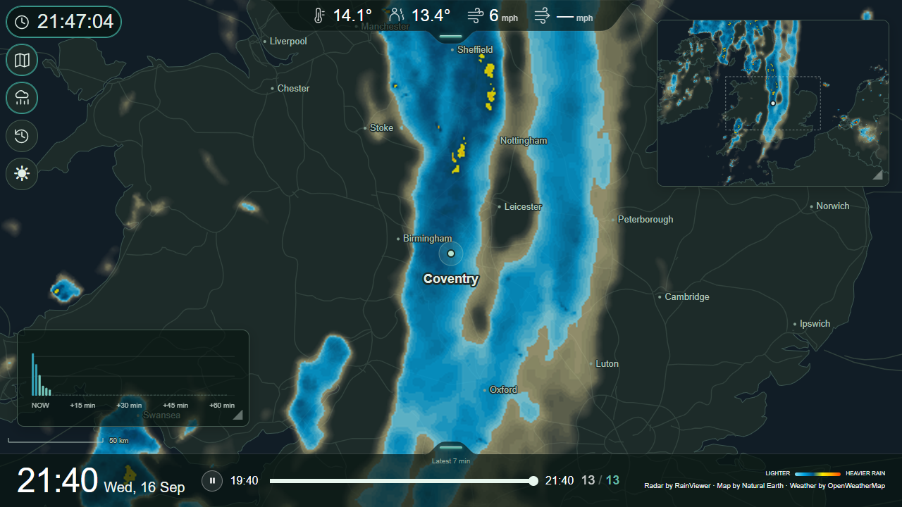

# User manual

## New controls in 0.8.0

**Layers** controls visibility and opacity separately for Main and Overview. Only enabled layers appear; hiding a layer does not stop its collection. The shared Rainbow request limit is under **System → API → Rainbow** and applies to rain and clouds together.

**Weather charts** show trends across the displayed window. Temperature, Humidity and Dew point start enabled for new browsers. Tap the widget to reveal **Edit**, then use toggles and draggable rows to select and order nine readings: those three plus Wind, Gust, T−Td, Visibility, Pressure and UV. **Detach** gives each enabled chart its own movable/resizable window; the main chart button hides/shows them together and remembers their positions. Turn Detach off to return to a stack. Each chart fits its recorded range, with a calm span for nearly constant values; it has no numeric scale. Grid spacing adapts to longer windows. Values retain their source/units; no wind-direction chart is included.

**Sun/Moon** uses bundled local calculations for the configured location/time zone, without provider downloads. Live uses current time; Archive uses its selected time. The compact widget shows the bodies rising/setting through its border and Moon phase; expand vertically to reveal event times. **Weather → Dock** has ordinary Sun/Moon visibility/order rows, off by default. **Units** selects Next event (default) or Altitude/direction for each. Compact Dock suffixes **r**, **s**, **p** mean rise, set and peak; the Dock retains its themed Moon icon. Widget information remains available through its help.

**Display → Auto-hide buttons** shares the 15-second inactivity/reveal timing of both dock auto-hide switches. Each switch stays independent. Tap to reveal hidden controls together. An open clock stays open. Chart Edit controls follow the same reveal timing.

**Camera** offers a one-to-ten-minute collection interval. Live retains the latest image; new Archive history retains one representative per ten-minute playback slot. Existing captured history is preserved. Archive never chooses a future image; missing matches remain gaps.

Cloud freshness may be stricter than normal publication delay warrants; see [cloud freshness](indicators.md#cloud-freshness-in-080). Thresholds remain unchanged in this release.

Controls and settings for Pi Rain Radar. Status meanings live in the numbered [indicator guide](indicators.md). For installation, use [Quick Start](quick-start.md) or the [Raspberry Pi build guide](raspberry-pi.md).

## One installation, multiple screens

| Shared by every screen | Remembered by each browser |
| --- | --- |
| Location, both map zooms, time zone | Widget positions/sizes and open/closed state |
| API connections, weather units/source/collection and settings PIN | Button visibility/order, theme and dock preferences |
| Radar acquisition, settling preference and retained history | Map scale, readings, UI lock, playback speed/window and gust cache |

Use the same browser profile and address each time. Hostname, IP address and localhost are different browser storage locations; switching between them starts a separate layout. Clearing site data also resets that layout. One Pi collects the data for all screens; more screens do not each make their own provider requests. Simultaneous-screen capacity has not been measured.

## Fresh-browser defaults

Dark theme; clock expanded; Overview and Rain forecast closed; Sun and Moon, Weather history, Clock, Overview, Rain forecast, Archive and Light/dark buttons visible; Camera and Stats for nerds buttons hidden; map scale on; both dock auto-hide switches and button auto-hide off; gust cache 60 minutes; Celsius/mph; temperature, feels-like, wind and gusts shown; 2-hour playback at 1×; UI lock off. Existing saved preferences take priority.

## Settings

The app starts on Coventry. Overview and Rain forecast start closed; fresh visible buttons are ordered Sun and Moon, Weather history, Clock, Overview, Rain forecast, Archive, Light/dark. Previously saved browser preferences keep their own order and visibility.

Tap the screen to reveal the **settings cog at the bottom right**. It disappears after 15 seconds of inactivity. Tap the cog to open settings. Display preferences apply immediately; Map, key and PIN changes use their own Preview/Apply or Save actions. No PIN is required by default.

Choose a section from the Settings selector:

- **Map:** Location, Regional, Embed
- **Interface:** Display, Buttons, Radar, Weather, Clouds, Camera
- **System:** Status, API (OpenWeather / Rainbow / HA), Storage, PIN, Log
- **Power**
- **About**

Small information icons beside setting titles explain their purpose without leaving the page.

Selecting a main section or reopening Settings starts its first sub-tab. System starts on Status. External links show their exact destination on hover.

### Radar sources and usage

**Interface → Radar** selects Main and Overview independently. RainViewer needs no key; Rainbow appears after configuring its key under System → API. Enable the required collectors here, then **Save and apply sources**. Disabling collection preserves history and credentials; it does not choose another provider. See [radar setup, usage and limits](radar-providers.md).

History retains observations from whichever providers were selected at that time. Switching sources does not clear it. Map geometry determines which retained history can be replayed.

### Weather readings and units

Use **Interface → Weather → Dock / Readings / Units / Forecast**. Dock visibility and order belong to this browser. Units, source mappings, fallback and background collection belong to the appliance.

On upgrade, explicitly confirm the initial shared units in **Units**. Existing archive observations are preserved and use that fixed baseline; former browser-specific unit changes cannot be reconstructed. Later shared changes take effect at their recorded time in Archive. Live always follows current shared units.

Save credentials under **System → API → OpenWeather / Rainbow / HA**. Saving a new key does not enable collection. Enable current readings under **Readings** and minute forecasts independently under **Forecast**. Existing enabled collectors remain enabled on upgrade. Switching either off preserves credentials/history and allows already-fresh values to expire normally.

**Home Assistant** can supply all ten source readings: temperature, feels-like, wind speed, gusts, direction, humidity, dew point, visibility, pressure and UV index. **Use OpenWeather** in a mapping is a normal source choice. Optional fallback uses fresh OWM data only when an HA-assigned reading is unusable; that individual reading is amber, with its reason in the tooltip. No usable source means a gap. Primary source and collection are independent.

**T−Td**, or dew point depression, subtracts dew point from temperature using each reading's configured source, including fallback. Inputs can come from different providers; hiding Dew point in the Dock does not disable the calculation. The subtitle shows OpenWeather, HA or OpenWeather/HA. Missing inputs leave a gap. Wind gust is optional: its own indicator can be amber, but it does not make the weather handle or aggregate availability amber.

HA values are not converted. Their reported units must match Settings, checked on every poll and immediately after changing app units. **Unit mismatch** means changing HA or this app's Settings to match. Recognised spelling aliases do not change the value. Readings use HA's `last_reported` as **Reported to HA**, not a promise of a new physical measurement. Reports older than ten minutes, missing timestamps and unavailable/invalid states are ineligible. Polling the same cached state does not renew its report time.

The shared HA connection uses the address reachable from the appliance. The browser can access the appliance remotely while its HA connection stays on the LAN. Connection health is checked separately on startup/save and every five minutes. Mapped weather readings are collected every five minutes, without forcing HA device updates. Keep any applicable upstream attribution; generic HA access does not override the source's terms.

### Device Power

Restart and Shutdown are under **Power**. Each asks for confirmation. The optional host helper must be installed first; without it, the buttons provide setup guidance. PIN protection follows the existing optional Settings PIN. See [Device Power setup and recovery](device-power.md).

### PIN: optional settings protection

In **System → PIN**, turn on **Enable PIN protection**, enter a six-digit PIN in each row of boxes and tap **Save**. Each box accepts one digit (0–9) and advances automatically. Completing the first row moves to confirmation; completing the second moves to Save. Digits are masked. Use Backspace or the arrow keys to correct a digit, or paste all six digits into the first box. Settings close; the next visit asks for that PIN on the keypad. Protected settings also lock when closed, when you switch away from the page, or after five minutes of inactivity. Interacting with Settings or its related popups resets this timeout; background polling does not.

To change the PIN, unlock settings and enter the replacement twice in **System → PIN**, then Save. To remove protection, turn the switch off and Save. Settings then open freely. Existing PINs stay enabled after an update. Closing without saving leaves protection unchanged. The PIN entry screen dismisses after 30 seconds without input.

If you forget an enabled PIN, follow [PIN recovery](troubleshooting.md#pin-recovery) below. No saved data needs to be deleted.

### Map: choose your area

Coventry is pre-set, so you can leave everything alone to try it first.

| Setting | What to enter |
| --- | --- |
| Location name | The label beside the centre dot. Leave blank to hide this label; the dot and other place names stay. |
| Latitude / Longitude | Your chosen centre in decimal degrees. A map service can show coordinates for a selected point. Copy latitude first, longitude second, including any minus sign. Coventry is `52.40801`, `-1.51041`. Typing a name alone does not move the map. |
| Time zone | Type a city/region name to find a suggestion, such as `Europe/Paris` or `America/New_York`. Defaults to `Europe/London`; select your own zone separately from the map coordinates. |
| Main map zoom | Larger numbers show a smaller area. Start at `8`; allowed range is `6–10`. |
| Overview zoom | Controls the small map independently. Larger numbers show less area. Start with the supplied value, `5`; allowed range is `2–7`, no greater than the main zoom. |

Tap **Preview** to see the proposed Main map and Overview before changing anything. Use **Back** to adjust the fields, or **Apply** in the preview when satisfied. Preview shows maps without rain or a distance scale and makes no radar requests.

The dashed rectangle in Overview follows the proposed centre and zooms. It outlines the full 1280 × 720 main map, both in Preview and during normal use. A differently shaped screen may crop that main map, so the rectangle can show more area than is visible on screen. The intended shape is 16:9 landscape, with 1280 × 720 as the tested reference. Higher display resolution does not automatically add detail to the fixed-size backend images.

**Preview and Apply validate your entries.** Missing required fields, invalid coordinates or time zones, unsupported zoom combinations and views crossing the map's polar boundary produce an error. The existing map stays unchanged. A blank location name is valid.

Tap **Apply**. Once accepted, Settings closes and the startup-style popup shows **Preparing map**, then **Preparing radar history** with completed/total frames. The count is acquisition progress, not a promise of exactly 13 displayed frames; extra candidates can be considered while preparing a view. You can leave this running without keeping Settings open. The backend uses the same coordinates and zooms to prepare matching radar for both maps; you do not configure the radar separately. The existing map remains visible until the new maps and radar are ready, then the page reloads. If preparation fails, your previous setup remains in use. After a coordinate change, old weather readings are cleared and the next eligible request supplies the new location. **Awaiting first OpenWeather response — allow 10–15 min** is normal during this wait. Current weather and Rain forecast follow the selected coordinates; zoom does not affect those point forecasts/readings.

Changing coordinates or either zoom selects a different history; it **does not delete the previous history**. Old images remain subject to the configured shared retention. Returning to the exact previous coordinates and both zoom values can restore that matching history while it is retained. Changing only the name or time zone preserves radar history. A time-zone change reloads the display and changes how timestamps are shown, without fetching new radar.

### Interface → Buttons: arrange your controls

Drag rows up or down to change the order of the left-side controls. Turn a row off to hide that button. **Hiding a button does not close its widget:** to leave Overview permanently visible, open it first, then hide its button here. To close it later, show the button again.

The two dock handles remain available for API status; screen interaction reveals the settings cog independently. Button order, theme and widget layout are remembered in this browser; another browser may have a different layout. Map settings and the weather key belong to the installation and are shared.

### System → API → OpenWeather: add current weather and Rain forecast (optional)

The app uses **OpenWeather One Call 4.0** for both features. An API key is a private access code from your OpenWeather account. It must have access to this specific service; another OpenWeather subscription may not include it. Check the [provider's current access and pricing information](https://openweathermap.org/api/one-call-4) and your account's request limit before enabling it. One Call 4.0 requires its own subscription, including for existing 3.0 users. As checked on 24 September 2026, the first 1,000 calls/day are free; the default 2,000-call daily limit allows chargeable usage. Set the limit to 1,000 to stay within the free allowance. Normal operation uses approximately 288 calls/day per installation (two requests every ten minutes), plus explicit key checks. Other applications and installations sharing the subscription also consume its allowance.

Paste the key into **Settings → System → API → OpenWeather**, then tap **Save key** and follow the link to enable **Interface → Weather → Readings / Forecast**. The message below the field reports whether the key is configured; when configured, Save becomes **Replace key**. Use **System → Status** for connection health and **Log** for available error details. Newly created keys may need activation time; do not repeatedly resave them. The app retries automatically.

Two requests supply current conditions and the minute forecast, normally every 10–15 minutes, shared by all displays. Saving a key triggers an additional check, subject to a short cooldown. Opening widgets or moving the radar slider does not make extra provider requests. Other apps using your OpenWeather account share its allowance.

The key stays on the computer running the app and is not displayed again. **Remove key** disables these features; radar continues working.

### Interface → Display: playback, scale, docks and UI lock

**Playback speed** offers 0.5×, 0.75×, 1× (default), then half-steps through 10×. At 1× an ordinary frame lasts 650ms, subject to image loading/settling. **Last frame hold** offers 1×–5× in 0.2 steps, default 2.4× (1560ms at playback speed 1×); 1× adds no extra hold. Both durations scale with playback speed. Live changes preview immediately, persist in this browser and do not affect acquisition. Archive has temporary speed/hold sliders; returning to Live restores the saved settings.

**Playback window** selects 2, 4 or 6 hours for Live on this browser and supplies the initial Archive duration. Archive has its own temporary 1–24-hour slider. Longer windows use retained history and more browser memory, without extra provider requests or retention.

**Lock screen controls** freezes dashboard buttons, widgets and playback controls while animation and updates continue. Settings stays reachable, with the PIN if enabled. A tap still reveals auto-hidden docks; a dock manually hidden with auto-hide off remains tucked away. Provider credits remain visible and their links remain active through an external-page warning. UI lock is a per-browser interaction guard, not a security boundary or an operating-system kiosk lock.

**Show map scale** controls the distance scale (on by default). Maps always face north; Preview omits the scale.

**Auto-hide footer dock** is off by default. Enable it to hide the footer after 15 seconds of inactivity; tap the screen to bring it back. It stays visible while you interact with controls or have a dialog open. The scale moves down when the footer hides. Widgets can use the full screen regardless of auto-hide. Docks can cover them without moving their saved positions; tuck a dock away to reach covered controls. These preferences are remembered on this browser, like button layout. Refreshing briefly shows the footer again and starts a new 15-second idle period.

**Auto-hide header dock** independently tucks away weather readings after the same 15-second idle period. Tap elsewhere on the screen to reveal them again. It is off by default. Both handles stay visible, and can be tapped to manually show or hide their dock when UI lock is off. Opening a dialog or holding a touch pauses idle hiding.

### Interface → Weather: units and gust cache

Choose temperature units independently from wind units: Celsius/Fahrenheit and mph, km/h, m/s or knots. Temperatures always show one decimal, including .0; wind speed and gusts round to whole numbers.

**Cache wind gust (min)** offers **0 (off), 15, 30, 45, 60, 90, 120 and 180 minutes**, defaulting to **60**. Zero disables retained fallback, not the gust reading itself. The last reported gust retains its original observation time through missing samples or provider errors. It survives restart, clears on location change or key removal, and adds no API requests. See [indicators](indicators.md) for retained/expired reading presentation and weather failure states.

### Interface → Weather → Dock

Toggle and drag rows to choose and order the ten source readings, derived T−Td and optional Sun/Moon entries listed under [Weather readings and units](#weather-readings-and-units). Unavailable fields show dashes. Wind direction follows your selected convention; see the [wind arrow guide](indicators.md#wind-arrow). It does not predict radar movement.

The top dock sizes to the selected readings, wrapping on narrow screens. Hiding every reading removes the numbers while keeping the health handle. Controls move below an expanded dock when they would collide and move back up when it tucks away.

### Interface → Radar: collection and settling

**Wait for radar to settle** is on by default and affects every connected display. It waits about five extra minutes before downloading new radar images. Turning it off allows earlier acquisition, but some radar tiles may be missing. Changes take effect on subsequent acquisition; they do not repair already cached imagery or increase polling frequency.

### System → Status and Log

**Status** links to RainViewer's status page and an independent OpenWeather monitor. External links show a short warning only in explicit kiosk mode because leaving the page can disrupt kiosk viewing; the independent monitor may not cover the service used here.

**Log** shows the last 25 important events since the app started. Capture continues while Settings is closed; LIVE means the viewer refreshes while open. Repeated events are grouped. This is a bounded in-memory troubleshooting aid, cleared on restart, with safe messages rather than raw provider responses or credentials. Full Docker logs remain available separately. The panel follows the selected theme.

## Using the screen

*Recorded v0.3.0 display, 16 September 2026, with Overview and Rain forecast open. Historical example, not live conditions.*

| Control | What it does |
| --- | --- |
| Clock, top left | Tap to show or tuck away the current clock, including seconds. |
| Light / dark | Switches theme. The icon shows what pressing it will do: sun for light, moon for dark. |
| Sun and Moon | Shows/hides the combined local astronomy widget. |
| Weather history | Shows/hides all enabled trend charts, including detached charts. |
| Layers, bottom left | Reveals per-map rain/cloud visibility and opacity controls for enabled layers. |
| Camera | Shows/hides the configured camera widget; collection is independent. |
| Stats for nerds | Shows/hides provider and acquisition diagnostics. |
| Folded map | Shows or hides **Overview**, a wider map with matching radar. The dot marks your centre; the dashed box marks the main map's area. |
| Rain cloud | Shows or hides **Rain forecast**, the forecast for approximately the next hour at your chosen coordinates. |
| Clock with backward arrow | Opens stored radar **Archive**. See below. |
| Footer handle | Shows or hides the footer. Its indicator reports selected radar sources and enabled clouds even while hidden; see [indicators](indicators.md). |
| Settings cog, bottom right | Appears on screen interaction for 15 seconds. Opens settings; asks for a PIN only when protection is enabled. |
| Weather drawer handle | Shows/hides the selected readings in their saved order and units. The handle indicates weather health even when all readings are hidden. |
| Play / pause, bottom | Starts or pauses the radar animation. Pausing does not stop new data being collected. |
| Slider | Drag to inspect a radar image and pause playback. Live normally has 13, 25 or 37 ten-minute positions for its 2/4/6-hour window; Archive supports 1–24 hours. See [indicators](indicators.md) for gap colours. Playback skips gaps; dragging selects the nearest available frame. |

Drag **Overview** or **Rain forecast** from anywhere on its map or chart to move it. Drag its bottom-right triangle to resize it. A small movement threshold separates taps from dragging. Tab to a widget and use arrow keys to move it; the resize corner has its own keyboard control. Overlapping widgets work like windows: click, drag, resize or focus a widget to bring it forward. Opening a widget also brings it forward. Dashboard controls remain above both widgets. See [indicators](indicators.md) for toolbar outline meanings.

The **large time and date at bottom left belong to the radar image currently playing**, not the present moment. The top-left clock shows the current time. All dates and clocks follow **Settings → Map → Regional → Time zone**, defaulting to Europe/London. Daylight-saving changes are automatic. Changing the map coordinates does not automatically choose a time zone.

### Colours and status

Use the numbered [screen indicator guide](indicators.md) for dock handles, retained weather, Rain forecast baselines, timeline gaps and rain intensity. For problems, start with System / Status, then Log for available details.

### Look back with Archive

Tap Archive, choose an available **Date**, **Time** and playback window, and select **Load**. Playback starts while the popup stays open. Use its top-right cross to dismiss it. The time is the window endpoint. Its **1–24-hour slider** defaults to the saved Live window and resets on return to Live. Only retained choices are offered; history builds while the server runs, with seven days retained by default. Closing preserves playback position and play/pause state. Comparison, speed and last-frame-hold overrides remain through closing and loading again, then reset to the saved Live settings when returning to Live.

The optional provider-name switch starts off on every Archive visit. It labels each map at top right and disappears on return to Live. Tap the Archive icon to return to Live or its date/time range to reopen the picker. The expanded control shows a ten-minute auto-return countdown. Selecting another window restarts it; cancelling the picker does not.

Archive never substitutes an older frame for a missing one. Live may borrow earlier compatible radar for less than 30 minutes; its gaps remain visible. Both modes include late arrivals and skip positions missing both maps. See [playback rules](playback-conventions.md) for endpoint grace and automatic pause/recovery.

Archive replays saved weather and camera snapshots alongside radar, preserving the recorded source, units and temporary-fallback colour. Returning to Live restores current weather and the latest camera snapshot. Manual Live scrubbing changes radar only.

Rain forecast comparison **None** shows the selected capture's next-hour forecast. Selecting **−10 through −50 min** shows a past two-hour analysis: bars are the first minute (OWM NOW estimate) of each saved capture, and the pink line is an earlier forecast for the same target time. Both axes run chronologically left to right; comparison changes the time window, not time direction. Saved captures are about ten minutes apart, so narrow bars mark actual sampling times, not continuous observed rain. Neutral unsampled intervals are distinct from missing expected data and genuine zero rain. The earlier capture can be up to ten minutes older than the requested lead; unavailable evidence stays a gap. This compares OWM against its own later estimates, not a rain gauge. −60 is excluded because the forecast horizon does not reliably cover it.

### Stats for nerds

Enable its button under **Interface → Buttons** to open the draggable/resizable widget. It reports each provider's latest observation, last/next check and acquisition state; selected-window availability; OpenWeather fetch/next-attempt timing; and local monthly Rainbow request/tile counts. These are not billing totals or guarantees of the next frame. It needs no extra host permissions and is separate from Log.

See the [Stats for nerds reference](stats-for-nerds.md) for metric definitions and tracking limitations.

## Embedded Radar

Use **Settings → Map → Embed** for a stripped-down iframe containing the main radar, status light and credits. See the [Embed guide](embed.md) for trusted origins, automatic saving, LAN setup and private HTTPS through Tailscale, with the tested scope recorded.

## About

For optional phone/laptop installation and private remote access, see [PWA and HTTPS setup](pwa.md). Normal browser and kiosk use do not require it.

The About tab identifies the app version and links to the project and provider information. Tap the version's info icon for [daily release checks](release-checks.md), including newer versions and dated saved results. Use the installed version when reporting a problem. See [upgrades](upgrading.md) and [troubleshooting/PIN recovery](troubleshooting.md).

### Camera setup

Configure one camera under **Interface → Camera**. Choose a direct snapshot URL or a camera discovered through the shared **System → API → HA** connection. Preview, then Add. The saved preview thumbnail is static. Edit opens a name-only update, retaining the secret connection without another preview; a blank name hides the label. **Replace connection** explicitly opens connection setup and validation. New captures use the new name; historical labels stay unchanged. Delete removes the setup without deleting retained history. The collection switch saves immediately. Enable the Camera button under **Interface → Buttons** to show the widget on this browser; collection and button visibility are separate.

Direct snapshot transport supports LAN HTTP or HTTPS with valid certificates. Images are fetched by the appliance, not each browser. The latest snapshot remains independent of manual Live radar scrubbing. Archive looks back at most ten minutes across retained camera sources, otherwise shows an empty widget. The image keeps its aspect ratio when resized.

### Archive storage

Set shared retention under **System → Storage**, default seven days, or use available storage as the limit. Reducing retention removes older history immediately when saved. Storage pressure rolls the oldest history sooner, across all captured streams, to keep Live playable. Status shows usage and warnings; expand **Archive retention** for estimates and detail. Retention is a target, not permission to exhaust the filesystem.

A browser may finish playing already-loaded frames after they roll out of storage. Loading a different window uses what remains available. See [archive backup](archive-backup.md) for preserving older archives before the new SQLite-storage upgrade; upgrading from a compatible 0.7.0 candidate does not reset the archive again.
