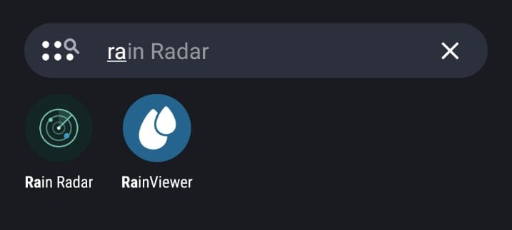
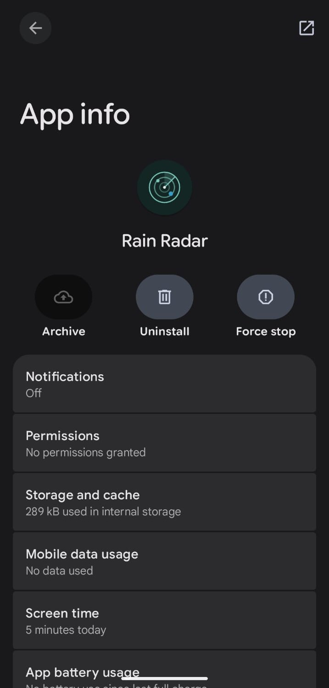
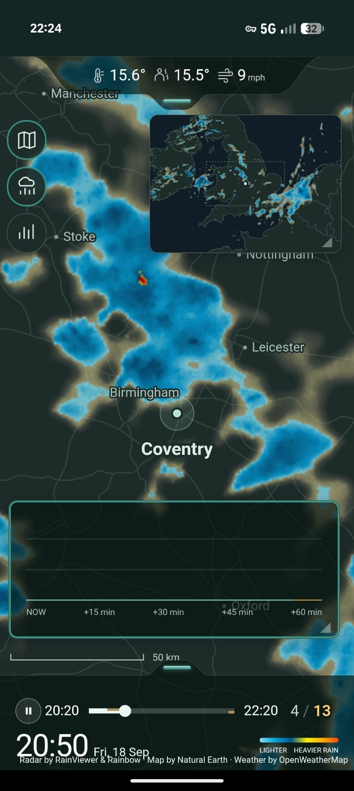
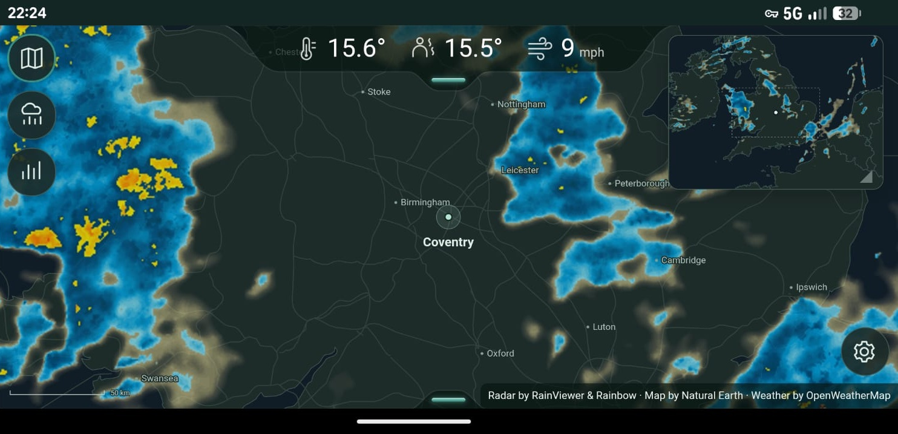
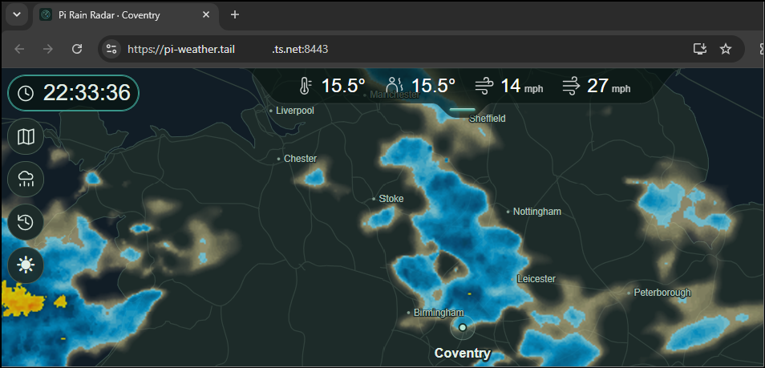
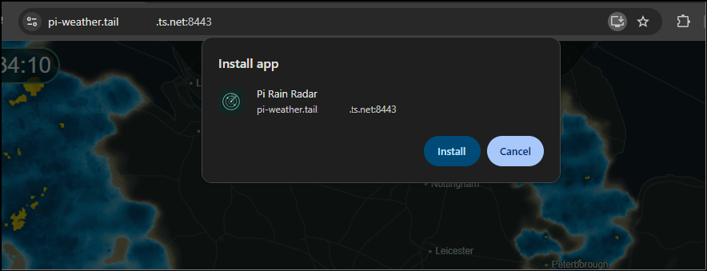
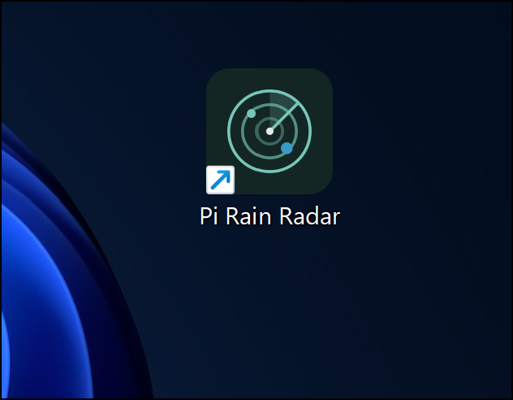
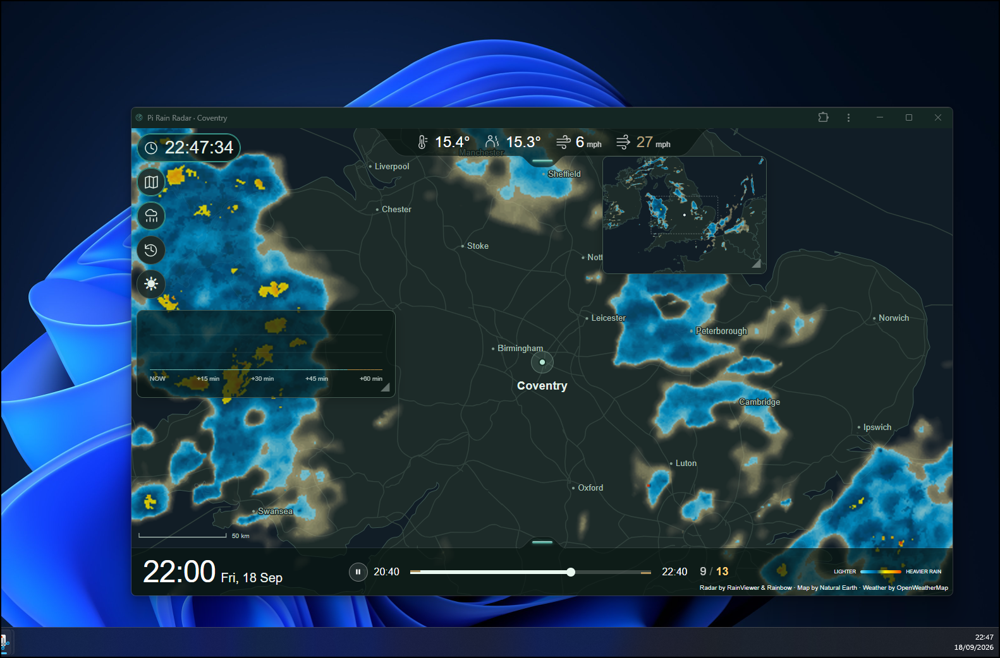

# Installed app: Android and Windows

Screenshots from my phone and Windows laptop on 18 September 2026, using Pi Rain Radar 0.5.0 served by my Pi through private Tailscale HTTPS. These show recorded conditions, not live weather. See the [setup guide](pwa.md) to install your own.

## Android phone

The installed app appears in the launcher and has an Android App info entry. The separate RainViewer app is also visible in the launcher screenshot; it is not required for Pi Rain Radar.

| Launcher | Android App info |
| --- | --- |
|  |  |

### Portrait

*Portrait view over mobile data, with Overview and Rain forecast open. Narrow-screen layouts are best effort; this is a display for a configured location, not a map with pan and zoom gestures.*

### Landscape

*Landscape gives the maps more horizontal space. The bottom dock is tucked away in this example.*

## Windows laptop

Open the Pi's HTTPS address in Chrome, install the app, then launch it from its shortcut. Private hostname portions in the supplied browser screenshots are obscured.

| Open in Chrome | Install app |
| --- | --- |
|  |  |

*The desktop shortcut launches the installed app.*

*The installed app has its own window. The Pi collects the data; the laptop displays it.*

Radar imagery by [RainViewer](https://www.rainviewer.com/) and [Rainbow](https://rainbow.ai/); maps by [Natural Earth](https://www.naturalearthdata.com/); weather by [OpenWeather](https://openweathermap.org/). The screenshots preserve the app's displayed attribution. Android and Windows interface appearance may vary by device and browser version.
