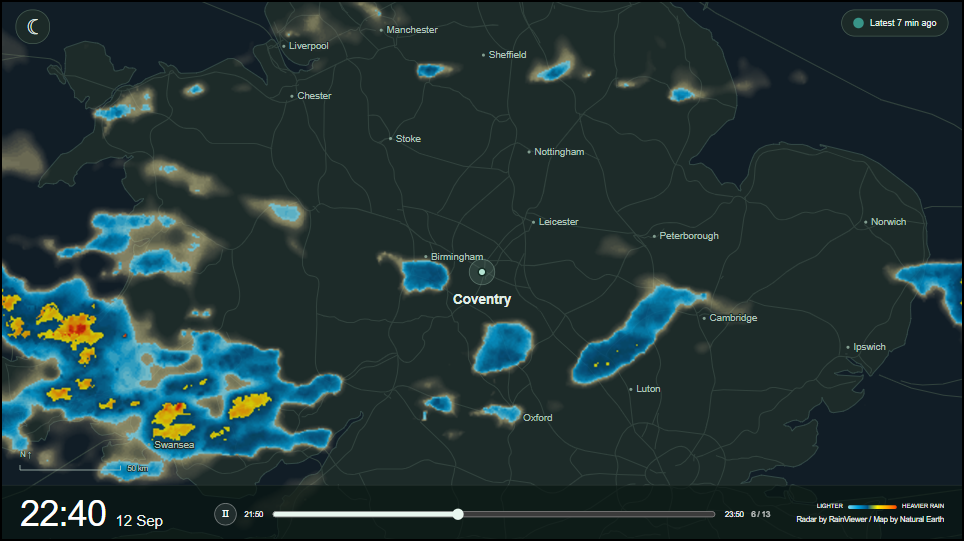

# Quick Start

Set up Pi Rain Radar, then learn what the screen is telling you. You do not need to write code or know Git. If someone has already installed it for you, skip to [Using the screen](#using-the-screen).

## 1. Get ready

You need an Internet connection, a web browser and Docker, the program that runs the app in the background. A keyboard is useful for initial setup; everyday controls work by touch.

- **Windows or Mac:** install and open [Docker Desktop](https://docs.docker.com/desktop/). Follow its setup prompts and wait until it is running. On Windows, use Linux containers.
- **Linux:** install [Docker Engine with the Compose plugin](https://docs.docker.com/engine/install/). The commands below assume Docker is already working for your user.
- **Display:** 1280 × 720 landscape is recommended. Other sizes work, but different screen shapes crop the map. Smaller screens rearrange the controls.

The app has been exercised on a laptop. A tested Raspberry Pi installation and automatic full-screen startup guide is still to come; this guide does not yet cover preparing a Pi or controlling its screen power.

## 2. Download and start

1. Open the [v0.1.1 pre-release](https://github.com/alex-soul/pi-rain-radar/releases/tag/v0.1.1), download **Source code (zip)** under Assets, then extract it into a folder you want to keep.
2. Open the extracted folder containing **compose.yaml** and **README.md**. Do not run commands inside the ZIP or its parent folder.
3. Open a terminal in that folder. On Windows, click File Explorer's address bar, type `powershell`, then press Enter. On macOS/Linux, open Terminal, type `cd ` (including the space), drag the extracted folder into the terminal, then press Enter.
4. Copy this command, paste it into the terminal and press Enter:

```sh
docker compose up -d --build
```

The first run downloads and builds what it needs; it may take several minutes. Once the command finishes, open **[http://localhost:3080](http://localhost:3080)** in a browser on the same computer. You can close the terminal; keep Docker running.

The map appears before the rain does. Allow roughly 2–3 minutes for the first radar sequence, potentially longer on a slow connection. No RainViewer account or API key is needed for radar. Current temperature and the minute forecast are optional and need a separate key, explained below.

`localhost` means “this computer”. On another device connected to the same home network, open `http://<host-name>.local:3080` or `http://<host-IP>:3080`, replacing the placeholder with the computer running the app. For example, a Pi named `pi-weather` is available at `http://pi-weather.local:3080`. If its name does not resolve, use its IP address instead.

### Enable LAN access on v0.1.0

The v0.1.0 download accepts local connections only. In its `compose.yaml`, replace `127.0.0.1:3080:3000` with `0.0.0.0:3080:3000`, then run `docker compose up -d` from the installation folder (use `sudo` on the Pi if required). This recreates the container with LAN access and retains its data. Version 0.1.1 and later default to LAN access; set `RADAR_BIND_ADDRESS=127.0.0.1` in a `.env` file beside Compose if you prefer local-only access.

### Configure from your laptop or phone

Open the host address above, then **Settings → API Keys** to enter your OpenWeather key with a normal keyboard. No SSH tunnel is needed. Location, map zoom, time zone, API keys and PIN configuration are shared with the kiosk. Each browser remembers its own widget positions/sizes, expanded panels, button arrangement, theme and Misc preferences. Changes to your laptop layout do not rearrange the kiosk.

Use the same address each time: the host name, IP address and an old SSH-tunnel address each have separate browser preferences. A new address starts with the default layout.

LAN access is intended for a trusted home network. HTTP does not encrypt the PIN or API-key entry, and the optional PIN only protects settings. Do not forward port 3080 through your router to the Internet.

## 3. Open settings

The app starts on Coventry. Overview and MinuteCast start closed; all buttons are shown in this order: Clock, Overview, MinuteCast, History, Light/dark. Previously saved browser preferences keep their own order and visibility.

Tap the screen to reveal the **settings cog at the bottom right**. It disappears after 15 seconds of inactivity. Tap the cog to open settings. All settings work immediately; no PIN is required by default.

### PIN: optional settings protection

In **PIN**, turn on **Enable PIN protection**, enter a six-digit PIN in each row of boxes and tap **Save**. Each box accepts one digit (0–9) and advances automatically. Completing the first row moves to confirmation; completing the second moves to Save. Digits are masked. Use Backspace or the arrow keys to correct a digit, or paste all six digits into the first box. Settings close; the next visit asks for that PIN on the keypad. Protected settings also lock when closed, when you switch away from the page, or after five minutes.

To change the PIN, unlock settings and enter the replacement twice in **PIN**, then Save. To remove protection, turn the switch off and Save. Settings then open freely. Existing PINs stay enabled after an update. Closing without saving leaves protection unchanged.

If you forget an enabled PIN, follow [PIN recovery](#pin-recovery) below. No saved data needs to be deleted.

### Map: choose your area

Coventry is pre-set, so you can leave everything alone to try it first.

| Setting | What to enter |
| --- | --- |
| Location name | The label beside the centre dot. Leave blank to hide this label; the dot and other place names stay. |
| Latitude / Longitude | Your chosen centre in decimal degrees. A map service can show coordinates for a selected point. Copy latitude first, longitude second, including any minus sign. Coventry is `52.40801`, `-1.51041`. Typing a name alone does not move the map. |
| Time zone | Type a city/region name to find a suggestion, such as `Europe/Paris` or `America/New_York`. Defaults to `Europe/London`; select your own zone separately from the map coordinates. |
| Main map zoom | Larger numbers show a smaller area. Start at `8`; allowed range is `6–10`. |
| Overview zoom | Controls the small map independently. Larger numbers show less area. Start with the supplied value, `5`; allowed range is `2–7`, no greater than the main zoom. |

Tap **Preview** to see the proposed Main map and Overview before changing anything. Use **Back** to adjust the fields, or **Apply** in the preview when satisfied. Preview shows maps without rain or a distance scale and makes no radar requests.

The dashed rectangle in Overview follows the proposed centre and zooms. It outlines the full 1280 × 720 main map, both in Preview and during normal use. A differently shaped screen may crop that main map, so the rectangle can show more area than is visible on screen. Landscape 1280 × 720 remains the recommended target; configurable render resolutions are a future consideration.

**Preview and Apply validate your entries.** Missing required fields, invalid coordinates or time zones, unsupported zoom combinations and views crossing the map's polar boundary produce an error. The existing map stays unchanged. A blank location name is valid.

Tap **Apply** and wait. The backend uses the same coordinates and zooms to prepare matching radar for both maps; you do not configure the radar separately. The existing map remains visible until the new maps and radar are ready, then the page reloads. If preparation fails, your previous setup remains in use. Current weather and MinuteCast follow the selected coordinates; zoom does not affect those point forecasts/readings.

Changing coordinates or either zoom selects a different history; it **does not delete the previous history**. Old images remain subject to the normal seven-day retention. Returning to the exact previous coordinates and both zoom values can restore that matching history while it is retained. Changing only the name or time zone preserves radar history. A time-zone change reloads the display and changes how timestamps are shown, without fetching new radar.

### Buttons: arrange your controls

Drag rows up or down to change the order of the five left-side controls. Turn a row off to hide that button. **Hiding a button does not close its widget:** to leave Overview permanently visible, open it first, then hide its button here. To close it later, show the button again.

The two dock handles remain available for API status; screen interaction reveals the settings cog independently. Button order, theme and widget layout are remembered in this browser; another browser may have a different layout. Map settings and the weather key belong to the installation and are shared.

### API Keys: add current weather and MinuteCast (optional)

The app uses **OpenWeather One Call 3.0** for both features. An API key is a private access code from your OpenWeather account. It must have access to this specific service; another OpenWeather subscription may not include it. Check the [provider's current access and pricing information](https://openweathermap.org/api/one-call-3) and your account's request limit before enabling it.

Paste the key into **Settings → API Keys**, then tap **Save key**. The status underneath reports connection errors or **Last fetched at…** after success. Newly created keys may need activation time; do not repeatedly resave them. The app retries automatically.

One request supplies both widgets, normally every 10–15 minutes. Saving a key triggers an additional check, subject to a short cooldown. Opening widgets or moving the radar slider does not make extra provider requests. Other apps using your OpenWeather account share its allowance.

The key stays on the computer running the app and is not displayed again. **Remove key** disables these features; radar continues working.

### Misc: scale, docks and gust cache

**Show map scale** controls the distance scale (on by default). Maps always face north; Preview omits the scale.

**Auto-hide footer dock** is off by default. Enable it to hide the footer after 15 seconds of inactivity; tap the screen to bring it back. It stays visible while you interact with controls or have a dialog open. The scale moves down when the footer hides. With auto-hide enabled, widgets can use the full screen and retain their saved positions after refresh; the returning footer may temporarily cover their lower edge. With auto-hide off, widgets fit above the visible footer; manually hiding it allows placement further down. These preferences are remembered on this browser, like button layout. Refreshing briefly shows the footer again and starts a new 15-second idle period.

**Auto-hide header dock** independently tucks away weather readings after the same 15-second idle period. Tap elsewhere on the screen to reveal them again. It is off by default. Both handles stay visible, and can always be tapped to manually show or hide their dock. Opening a dialog or holding a touch pauses idle hiding.

**Cache wind gust (min)** defaults to **60**. Enter a whole number from 1 to 1440; it saves automatically in this browser. The latest reported gust remains visible through missing samples or OpenWeather errors until that many minutes after its observation time, then becomes a dash. A muted amber gust number means a retained value is being used; the icon and mph keep their usual colours. Hover over the gust for its timestamp. The backend keeps one gust reading across restarts, clears it when the coordinates change or the key is removed, and makes no extra API calls. Temperature, feels-like and wind allow one failed poll: retained numbers turn muted amber. After two consecutive failed polls, or once their observation is 30 minutes old, they become dashes. A successful poll restores normal colours and resets the failure count; the API handle remains amber during errors.

## Using the screen



*Example radar view; the current version has additional controls described below.*

| Control | What it does |
| --- | --- |
| Clock, top left | Tap to show or tuck away the current clock, including seconds. |
| Sun / moon | Switches theme. The icon shows what pressing it will do: sun for light, moon for dark. |
| Folded map | Shows or hides **Overview**, a wider map with matching radar. The dot marks your centre; the dashed box marks the main map's area. |
| Rain cloud | Shows or hides **MinuteCast**, the forecast for approximately the next hour at your chosen coordinates. |
| Clock with backward arrow | Opens stored radar **History**. See below. |
| Footer handle | Shows or hides the footer. Its colour reports RainViewer health, even while the footer is hidden. Small Latest/Next messages sit above playback when expanded. |
| Settings cog, bottom right | Appears on screen interaction for 15 seconds. Opens settings; asks for a PIN only when protection is enabled. |
| Weather drawer handle | Tap to expand or collapse current temperature, feels-like temperature, wind and wind gusts, in that order. Gusts use the latest available reading within the configured cache duration, otherwise a dash. Values are °C and mph. The drawer stays at the top on all screens; toolbar buttons remain above it if they overlap. |
| Play / pause, bottom | Starts or pauses the radar animation. Pausing does not stop new data being collected. |
| Slider | Drag to inspect a radar image. This pauses playback; tap Play to resume. The times at either end describe the two-hour window, with 13 fixed ten-minute slots. Muted amber sections on the unplayed track mark missing frames; the filled track covers them as playback passes. Playback skips gaps and dragging snaps to the nearest available frame. |

Drag **Overview** or **MinuteCast** from anywhere on its map or chart to move it. Drag its bottom-right triangle to resize it. A small movement threshold separates taps from dragging. Tab to a widget and use arrow keys to move it; the resize corner has its own keyboard control. Overlapping widgets work like windows: click, drag, resize or focus a widget to bring it forward. Opening a widget also brings it forward. Dashboard controls remain above both widgets. A greenish button outline means that control is expanded or its widget is shown; it is not an API-health indicator.

The **large time and date at bottom left belong to the radar image currently playing**, not the present moment. The top-left clock shows the current time. All dates and clocks follow **Settings → Map → Time zone**, defaulting to Europe/London. Daylight-saving changes are automatic. Changing the map coordinates does not automatically choose a time zone.

### Colours and status messages

| Signal | Meaning |
| --- | --- |
| Footer handle: greenish | Latest radar is under 30 minutes old, with no reported acquisition/connection error. |
| Footer handle: amber | Radar is at least 30 minutes old, or acquisition/the connection has a problem. Cached images can still play. |
| `Latest 12 min` | The newest available radar is 12 minutes old, regardless of which image you are playing. From one hour onward this uses decimal hours: `1.5 hours` means 1 hour 30 minutes. |
| `Next in 2 min` | A discovered radar frame is pending; this estimates when acquisition can start. It is not a guarantee of completion. The message disappears when nothing is pending. |
| `Fetching…` | New radar is being acquired. |
| Frame counter, e.g. `7 / 13` | You are viewing image 7 of 13. The total is greenish for a full 13-frame window, amber when fewer are available. This applies in History too. |
| Weather drawer's small handle line | Greenish when weather/forecast data is usable, amber from the first failed poll or when data expires, white when no key is configured. Missing optional gusts alone do not make it amber. This remains visible with the drawer collapsed. |
| Weather numbers: normal colour | Fresh readings from the latest successful weather response. |
| Weather numbers: muted amber | Retained readings. Temperature/feels-like/wind allow one failed poll and expire after 30 minutes; gusts use the Misc cache duration (60 minutes by default). |
| Weather value: `—` | No usable reading: absent, expired, or two consecutive failed polls for temperature/feels-like/wind. |

Radar checks run every five minutes. Newly discovered frames wait at least another five minutes before download, to allow the provider time to complete them. The estimate includes the polling schedule, so **Next can occasionally exceed five minutes**. “Latest” includes the provider's own delay as well; this is not an instantaneous view of rain.

Radar colours run from lighter rain to heavier rain, as shown by the footer colour strip. The colour is rain intensity, not connection status. A clear patch does not prove it is dry: provider coverage or missing tiles can leave gaps even in a green, 13-frame sequence.

MinuteCast is a **forecast**, separate from the past radar animation. Taller bars mean more predicted precipitation; faint baseline bars represent zero predicted precipitation. Missing samples are gaps, not zero rain. A quiet chart with a greenish weather drawer handle can simply mean no rain is forecast. Unavailable readings use dashes/messages rather than invented values.

### Look back with History

Tap History, choose an available **Date** and **Time**, then **Show**. The chosen time is the end of a two-hour window. Only locally stored choices are offered; history builds as the app runs and is kept for seven days. It cannot recover data from before installation or while the machine was off.

The History dock expands to show the selected window. Use the same play/pause and slider controls. Tap the **History icon** to return to Now; tap the **date/time range** to reopen the picker. The outer edge of the expanded History dock shows the ten-minute countdown to an automatic return. Selecting another window restarts it; opening and cancelling the picker does not. Hiding History in Buttons hides both touch targets, but automatic return still works.

Background collection continues. The footer freshness messages still describe the latest acquired radar. **Current weather and MinuteCast remain current even while historical radar plays**—they do not yet have historical playback.

## Stop, restart or update

Run these commands from the extracted app folder, just as during installation.

| Task | Command |
| --- | --- |
| Stop the app | `docker compose stop` |
| Start it again | `docker compose up -d` |
| Restart the running app | `docker compose restart radar` |
| Show recent diagnostic messages | `docker compose logs --tail 50 radar` |

For an update, stop the app, download and extract a fresh ZIP from the repository, then run `docker compose up -d --build` from that new folder. Use the supplied Compose configuration unchanged: its fixed application name keeps the same saved data on the same Docker installation. Refresh the browser afterward. Check the README for any release-specific instructions before updating.

Settings, the PIN, key and radar archive are stored separately in Docker's persistent storage. Ordinary stops, restarts and rebuilds preserve them. **Do not delete the app's Docker volume or use `docker compose down -v`** unless you intend to erase them. Browser layout preferences are separate and can be lost if browser site data is cleared.

## If something looks wrong

| Problem | Try this |
| --- | --- |
| “no configuration file provided” | Open the terminal in the folder containing `compose.yaml`, then run the command again. |
| Docker command missing, or cannot connect to Docker | Finish Docker installation, open Docker Desktop if applicable, and wait until it is running. Reopen the terminal after installation. |
| Browser cannot open the page | Check Docker is running, run `docker compose up -d`, and open `http://localhost:3080` on that same computer. |
| Old radar after sleep or a network outage | Confirm Docker and Internet access have recovered. Allow time for the next check and downloads. If it stays stuck, refresh the page, then check recent logs or restart the app. Sleep pauses acquisition; it does not build history in the background. |
| Amber radar / fewer than 13 frames | Let acquisition retry. The provider may have missing frames or be unavailable. Playing cached data is expected. |
| No temperature or minute forecast | Save a One Call 3.0-enabled key, then read the connection message in API Keys. A radar-only setup works without it. |
| OpenWeather reports HTTP 401/403 | Check the key, activation and One Call access in your provider account. |
| OpenWeather reports HTTP 429 | Check your account request limit and other apps using the account. The app retries automatically; repeated saves will not fix a provider limit. |
| A toolbar button disappeared | Open **Settings → Buttons** and enable it again. Tap the screen to reveal the settings cog. |
| Forgot the PIN | Follow [PIN recovery](#pin-recovery). There is no need to delete saved data. |

For technical details, see [Run and develop](development.md). For project status and hardware plans, see the [README](../README.md).

## PIN recovery

Use a terminal on the computer running Docker, or connect to that computer over SSH. Open the folder containing the app's `compose.yaml`. These commands use your access to Docker; they do not ask for the old app PIN.

### Set, replace or enable a PIN

The original command still works:

```sh
docker compose exec radar node src/setup-pin.js
```

Enter a new six-digit PIN, press Enter, repeat it and press Enter again. Input is hidden: no digits or dots appear in the terminal. Leading zeroes are supported. A mismatch or cancellation with Ctrl+C leaves the existing PIN unchanged. Never put the PIN itself in the command line.

The explicit commands below perform the same operation: choose a new PIN and enable protection.

```sh
docker compose exec radar node src/setup-pin.js --set
docker compose exec radar node src/setup-pin.js --reset
docker compose exec radar node src/setup-pin.js --enable
```

Use any one of these commands. `--enable` asks for a new PIN because disabling removes the previous PIN hash.

### Disable a forgotten PIN

```sh
docker compose exec radar node src/setup-pin.js --disable
```

This removes PIN protection immediately. Close and reopen settings in the browser; they will open freely. You can then set a new PIN in the PIN tab whenever you want.

### Check status

```sh
docker compose exec radar node src/setup-pin.js --status
```

This prints only whether protection is enabled or disabled. `--help` lists the commands.

All changes persist across restarts and require no container restart. Set/reset/enable invalidates old unlocked sessions; close and reopen browser settings after recovery. A delay caused by failed PIN guesses can remain for up to five minutes after setting a replacement; wait before retrying. Disable allows access immediately.

The map configuration, OpenWeather key and radar archive are preserved. Do not delete the Docker volume to recover a PIN. If Docker reports that the service is stopped, run `docker compose up -d` first. If the command reports that recovery is unavailable, check the data volume and filesystem permissions; do not erase the volume.

### Progress after changing the map

Once Apply is accepted, Settings closes and the same progress popup used at first startup appears. It first shows map preparation, then the completed radar-frame count. The current map stays underneath until the replacement is ready; connected browsers switch automatically. Preview does not apply a change or trigger this popup. If preparation fails, the popup explains the failure and lets you continue with the current map.
